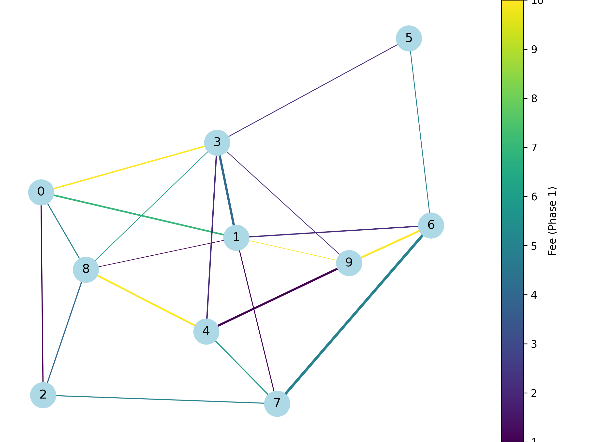

# Lightning Network Routing via Electrical Circuit Modeling
What if Payment Routing wasn't a search problem...
but a physics problem?

Instead of forcing the algorithms to find the path,
what if we let nature decide?

This project reimagines the Bitcoin Lightning Network as a living electrical circuit -
where fees becomes resistance,
channels becomes wires,
and payment flow like current through a network of energy.

Nature always finds the path of least resistance.
So why shouldn't routing?

-----

# The Vision
The Lightning Network is a graph of nodes and channels.
In this project we see them as:-

Lightning Network - Electrical Circuit
Nodes - Electrical Junction
Channel - Resistor (Wire)
Fee - Resistance
Capacity - Maximum Current
Payment - Injected Current

Instead of running Dijkstra's algorithum,
we solve Kirchoff's laws.

Instead of searching paths,
we solve linear systems.

Routing becoomes physics.

-----

# Phase 1 - Building the Electrical World

Before current can flow, the circuit must exist.

Phase 1 constructs a synthetic Lightning-Network-Data that mirrors real-world structure:

- 10 interconnected nodes
- Hub-based topology (simulating routing hubs)
- Randomized channel fees
- Randomized channel capacities
- Minimum degree>= 2 (No isolated islands)
- Visualized network structure
- JSON export for reproducibility
- Saves a png image of Generated Network Data

This is the foundation.
The world before Electricity Flows.

# Network Visualisation

Below is the Image of Synthetic Lightning Network Data-

# Visual Encoding

The Visualisations isn't just aesthetic - it's preparation for Next.

- Edge Thickness is proportional to Channel Capacity
- Edge Colour is proportional to Channel Fee

Next phase of the project will make:-
- Fee - Resistance
- Capacity - Maximum Current 

----

# Output

Running Phase 1 Generates:
Synthetic_lightning_network_data.json
Saved Visualistion of the Synthetic Lightning Network Data Graph.

This file stores structured channel data (nodes,fees,capacities) and will be used in Phase 2 for Electrical Modeling.